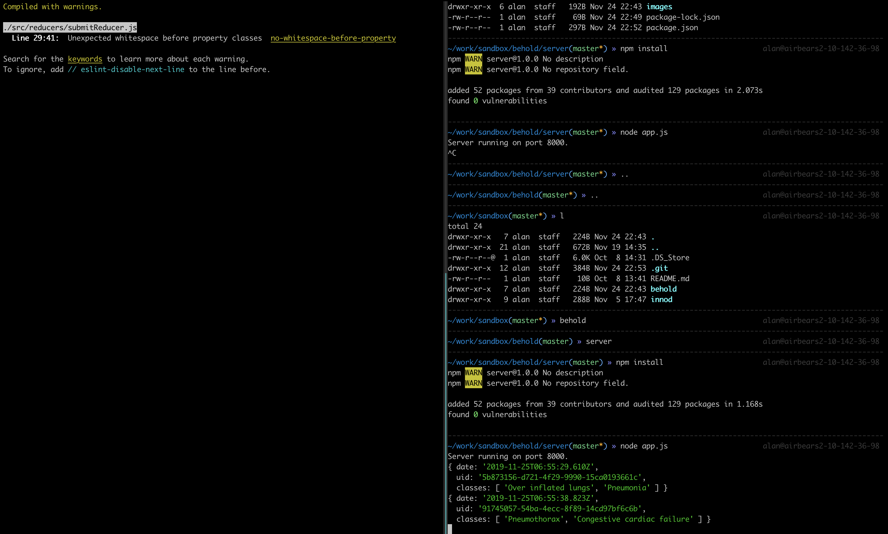

# Web-based PACS Viewer

A PACS viewer that renders X-Ray images for annotation.

## Installation Guide

You'll be running both the client and the server on separate windows or terminals, however you wish. Enter both the `client` and `server` directories and run `npm install`.

Run `npm start` in your client terminal/window. Run `node app.js` in your server terminal/window. An example would look like the following screenshot, where the client window is on the left and the server window is on the right.

## Usage

The server terminal will output any data that is posted to the endpoint `/images/:id`, for `id` is the `SOPInstanceUID` for an image.